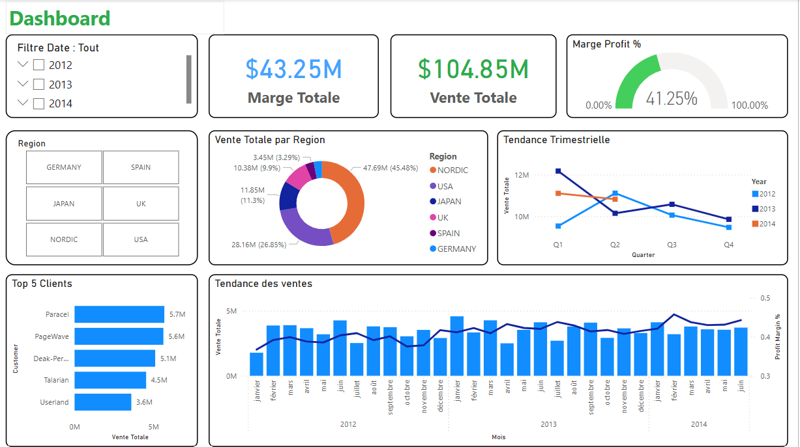
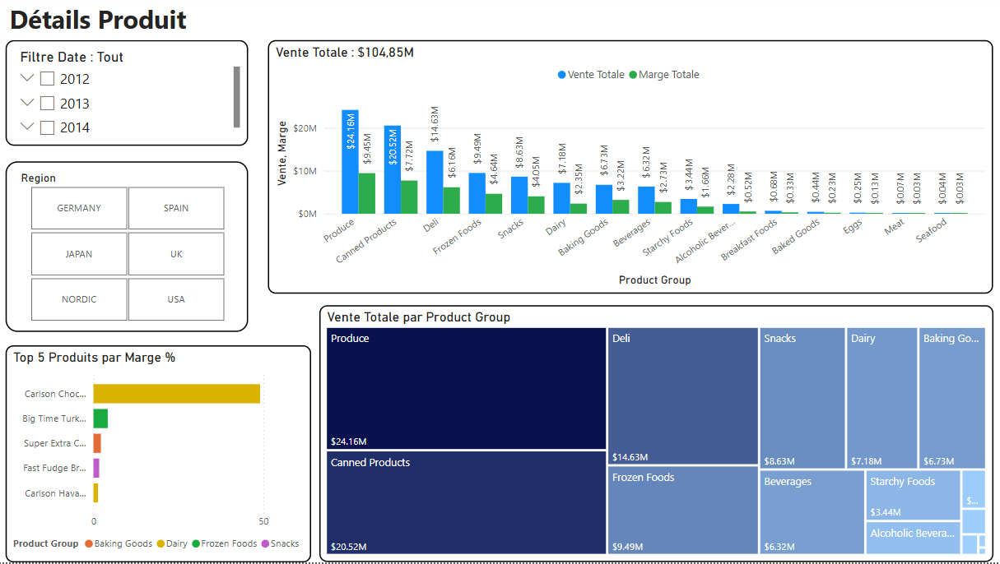
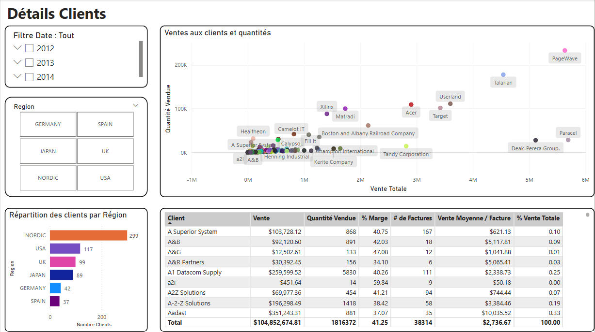
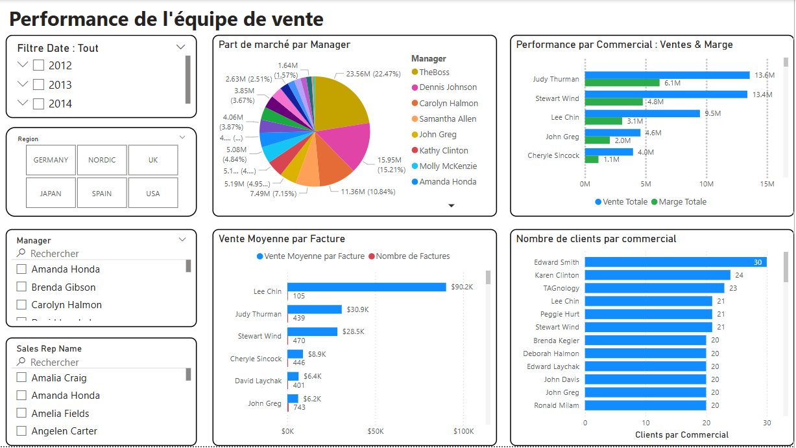

# 📈 Sales Performance Analytics - GoodSales (Power BI)

This project is a comprehensive Business Intelligence solution developed for **GoodSales**. It transforms raw sales data into a strategic tool for monitoring KPIs, analyzing profitability, and tracking sales representative performance.

## 🎯 Project Overview
The dashboard provides a multi-layered view of the business, allowing stakeholders to drill down from global trends to specific customer and product metrics.

### Key Pages & Screenshots
#### 1. Global Dashboard
Provides an executive overview of Total Sales, Margins, and Market Share by Manager.

#### 2. Product Details
Focuses on inventory categories, identifying top-selling products and profit drivers.

#### 3. Customer Details
Visualizes geographic distribution and customer concentration to optimize marketing efforts.

#### 4. Sales Rep Performance
A dedicated view for HR and Sales Managers to track individual targets, invoice counts, and average transaction values.

## 🛠️ Technical Implementation

### Data Modeling (Star Schema)
The project utilizes a clean **Star Schema** to ensure optimal performance and filter propagation.
* **Fact Table:** `Sales`
* **Dimensions:** `Calendar`, `Products`, `Customers`, `Sales Representatives`, and `Geography`.

### ETL & Power Query
* Data cleaning and normalization performed via **Power Query (M)**.
* Handled data type conversions, null value management, and column restructuring.

### DAX Calculations
Advanced DAX measures were implemented to provide dynamic insights, including:
* **Total Sales & Total Margin**
* **Average Basket Value** (Total Sales / Number of Invoices)
* **Market Share %** (Manager Sales / Total Sales)

## 📁 Project Structure
* `BI-dashboard.pbix`: The source Power BI file.
* `Documentation/`: Full technical report (PDF) explaining the "Rapport d'étonnement" and modeling choices.
* `screenshots/`: High-resolution captures of the dashboard pages.

## 🚀 How to Use
1. Clone this repository.
2. Open `BI-dashboard.pbix` in **Power BI Desktop**.
3. Use the slicers on the left/top of each page to filter by Date, Manager, or Region.
